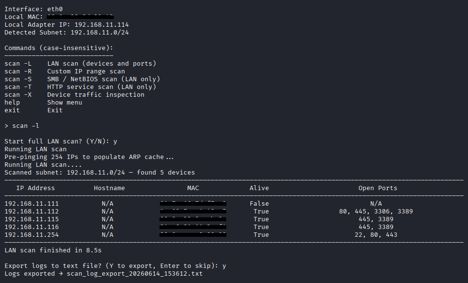

<div align="center">

# Core Net Scanner

</div>

<br>

<div align="center">
<a href="#overview"><b>Overview</b></a> &nbsp; ✦ &nbsp;
<a href="#installation"><b>Installation</b></a>
</div>

<br>

<a name="overview"></a>


**Core Net Scanner** is a cross-platform Python network scanner that enables device discovery and open port detection across local IPv4 subnets, including Wi-Fi and Ethernet.
Built for ethical diagnostics, security awareness, and administrative auditing, it is suitable for both personal and organizational use.

If you would like to contribute, I would greatly appreciate it. Please read the [contribution guidelines](CONTRIBUTING.md).

Licensed under the [MIT License](LICENSE).

---

## ✨ Features

- **LAN Detection Mode**, detects your IPv4 subnet and scans the local network
- **Custom Scan Mode**, user can select to target a spesific IP address or IP ranges
- **HTTP Service Scan**, identifies web services running on discovered hosts
- **Fast & Accurate**, combines ICMP, ARP, and socket checks and auto discovery
- **Port Detection**, scans common service ports (FTP, SMB, SSH, RDP, and more)
- **Basic Traffic Inspection** module, real-time monitoring of active TCP connections
- **Logging system**, exportable log file (TXT format) for more detailed output

For a detailed list of all common ports scanned by Net Scanner, see [PORTS.md](PORTS.md)

---

## 📸 Kali Linux




---

## ✔️ Lawful Use

This tool is intended solely for lawful and authorized use.
You must obtain explicit permission from the network owner before scanning, auditing, or testing any systems.
The author assumes no liability for misuse or for actions that violate applicable laws or organizational policies.
Use responsibly and in compliance with your local governance.

---

## 📌 Safety Notice

**Core Net Scanner** is safe to use when downloaded from the official source.
Because the application performs network discovery and scanning, some antivirus products may incorrectly flag or restrict its execution. This is a common false positive for legitimate network diagnostic tools.
If you trust this application, you may need to add it as an exception in your antivirus software.

---

<a name="installation"></a>
## 💾 Installation

### 🐍 Cross-platform

#### 1️⃣ Requirements
- Python **3.0+**
- Works on **Windows** & **Linux**
- Dependencies: `pip install psutil`, `pip install requests`

#### 2️⃣ Script
- Download the script [net_scanner.py](src/net_scanner.py)

#### 3️⃣ Run
- Windows: `python net_scanner.py`
- Linux:<br> 
      1. `chmod +x net_scanner.py` <br>
      2. `python3 net_scanner.py`

---

## 📁 Project Structure

```bash
core_net_scanner/             # Main project folder
│
├── media/                # Images, diagrams, UI assets
│
├── src/                  # Core application source code
│
├── CHANGELOG.md          # Version history
├── CONTRIBUTING.md       # Contribution guidelines
├── LICENSE               # Project license
├── PORTS.md              # List of all common ports scanned by the app
├── README.md             # Main documentation
├── SECURITY.md           # Security policy
└── .gitignore
```
